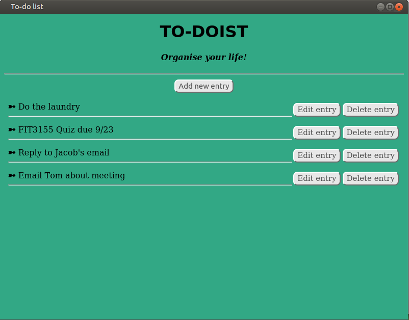

# To-doist - Organise your life!
## A Linux GUI created using Hipe 
### Or: How I Learned to Stop Worrying and Love the DOM
---



This is a complete guide to making **To-doist** from scratch. You can consider this a primer on Hipe, teaching you the basics of using Hipe, and getting you started.

Checklist to complete before starting this guide:
- [x] Have a working Ubuntu Linux distro OS (recommended version 20.04)
- [x] Hipe is currently installed and configured by following [this](start_here.md) guide.
- [x] Had a nice cup of coffee and ready to get started (*this one is optional, but highly recommended*).

To get started, we need to discuss how a Hipe-based application works. 

## Understanding flow of control in Hipe
GUIs are generally event-driven applications. According to Wikipedia, [event-driven programming](https://en.wikipedia.org/wiki/Event-driven_programming) is a programming paradigm in which the flow of the program is determined by events such as user actions (mouse clicks, key presses), sensor outputs, or message passing from other programs or threads.

The basic idea is to have a main program loop that runs continuously, and *listens* for events, such as a button or a key being pressed. We create functions called *event-handlers* that are designed to handle the event, i.e. change the program state, I/O, visuals, etc. in response to the input. 

Now, it might be possible to create Hipe applications that have no events, but generally speaking, user-interactivity is made possible through the appropriate use of such events and event-handlers. 

**To-doist** is a to-do list program that allows the user to enter, edit and delete entries using buttons and text input. Looking at the screenshot, we can see there are three types of buttons:

- Add note button
- Edit note button
- Delete note button

Clicking any button must call the appropriate event-handler for that button, to handle the input.

Therefore, a high-level conceptual overview of making To-doist might be something like:

1. Create and place all initial elements (Title, Add note button, etc.)
2. Run main program loop, listens for input (*event*):
    - When Add note button is pressed, open dialog box to allow user to enter text
    - When Edit note button is pressed, open dialog box to allow user to edit text
    - When Delete note button is pressed, delete the corresponding list entry
3. If program exit value is called, exit the program. 

The above steps seem fairly simple. Of course, as always, the devil is in the details, where we ourselves struggled the most. Hopefully, with this guide in hand, you'll find it much easier. 

## Let's get started

To begin with, we'll create a file and call it 
```
todo.c
```
Open the file in your favourite code editor, and we can get started (We recommend Visual Studio Code). 

Like any good C file, ours start with declaring the header files that contain the functions that we want to use in this file. For our purposes, we need the following:

```
#include <hipe.h>
#include <stdlib.h>
#include <stdio.h>
#include <unistd.h>
#include <string.h>
```

Notice the 'hipe.h' file, which includes all the hipe functions that we'll be using. The others are fairly standard C library files. 

Next, we'll define the following constants:

```
#define NEW_LIST_ENTRY_EVENT 1
#define NEW_LIST_DELETE_EVENT 2
#define NEW_LIST_EDIT_EVENT 3
#define EXPORT_TO_FILE_EVENT 4
#define LOAD_FROM_FILE_EVENT 5
```

These are used as the 'requestor' codes passed on to Hipe, to differentiate which event is taking place. This will be discussed in the later parts where relevant, but for now, just trust us and put these in the file.

Next, we define a constant value to store the maximum number of entries we will save to file. We have set an arbitrary limit of 1000, but you can change it depending on how many entries you want to save, and if your system can handle it (most likely, it can handle a much larger number of entries). 

```
#define MAX_NUM_ENTRIES_IN_FILE 1000
```

We are done with the constants. Now, moving on to the global variables, we define some variables to keep track of program state. We will use these for various purposes throughout the program. Let's declare them as follows:

```
int counter; 
hipe_session session;
char* listEntries[MAX_NUM_ENTRIES_IN_FILE]; load from file
bool loaded_already;
```

- *Counter*: this is an int value that stores the *next* list entry index. Basically, if we have entered 4 entries into our list, this will store 5. We will use it to keep track of how many entries we've added, and as an index variable for the list entries array. 

- *session*: This is a 'hipe_session' type variable, it is the current session that we initialise and use for the application. This variable is very useful, and is required for every command that we send to the hipe server. Making it a global value means we have access to it in all the functions without having to pass it. 

- *listEntries*: This is an array that we declare to be of size MAX_NUM_ENTRIES_IN_FILE. It is a string array, with each entry storing one user entry. We will use it to store all user entries, as well as when we write and load from the file.

- *loaded_already*: A boolean value (true/false) to indicate if user has already loaded something from file. We don't want the user to keep loading the same entries from the same file and keep overwriting it, so we keep track of it using a boolean.

Next, we'll do some intitialisation, and declare some useful auxiliary functions. Initialisation is important to make sure that our program starts with the correct initial values for our variables. Auxiliary functions make our life easier by allowing us to do some commonly repeated tasks using a simple function call. 

Initialise the global variables to default values. 

```
void init()
{
    counter = 1;
    loaded_already = false;
    clearEntriesList(); // Calling auxiliary function to initialise the array
}
```

All elements in the array are set to empty. Note that "\0" is the termination character for a string. So we initialise all positions to be null initially. 
```
void clearEntriesList() 
{
    for(int i = 0; i < MAX_NUM_ENTRIES_IN_FILE; i++) 
    {
        listEntries[i] = "\0";
    }
}
```

Utility function to concatenate two strings and return the result
```
char* concat(const char *s1, const char *s2)
{
    char *result = malloc(strlen(s1) + strlen(s2) + 1); // +1 for the null-terminator
    strcpy(result, s1);
    strcat(result, s2);
    return result;
}
```

This is a useful utility function for hipe. Each element in a DOM layout has a 'location', in hipe, this location is of type 'hipe_loc', and we can use this location to interact and manipulate the elements. This utility function will return the hipe location of the element by its ID. (We must assign a unique ID to the element when creating it, in order to be able to find it).
```
hipe_loc getLoc(char* id) 
{
    hipe_send(session, HIPE_OP_GET_BY_ID, 0, 0, 1, id);
    hipe_instruction instruction;
    hipe_instruction_init(&instruction);
    hipe_await_instruction(session, &instruction, HIPE_OP_LOCATION_RETURN);
    return instruction.location;
}
```

Note that in the above, we have seen how we can send hipe instructions to the server. We highly recommend you read the hipe instructions page of the documentation to learn more about the format used. 

hipe_send() is a utility function that makes it easy to send a hipe instruction to the server. It creates a hipe_instruction, initialises it, and transmits it to the server with the OP_CODE and the arguments. It's a very useful function that we'll use throughout the program. We recommend you read the docs page on hipe_send to learn more about its formatting and usage. 

Here is another simple function that we'll use to display dialog box to the screen. A simple dialog box has just a title and a dialogText, which the function will receive as arguments. 
Then, it sends a HIPE_OP_DIALOG instruction to the hipe server.
```
void displaySimpleDialog(char* title, char* dialogText) 
{
    hipe_send(session, HIPE_OP_DIALOG, 0,0, 2, title, dialogText);
}
```

# main()

Now, in the code file for Todoist, we first define all the functions that we use, and finally we define the main function at the end. This is standard practice as you must define your functions before you use them. 

But for this tutorial, it'll make it easier if we start from the main function, so you can actually see how and where we will call different functions. Once we're done with main(), we will define all the other required functions. This should make it easier to follow the program flow, as the execution of the program beings in main(). 

Let's define the main function as follows:

```
int main(int argc, char** argv)
{
    // ADD REST OF THE CODE HERE 
    return 0;
}
```

The first step is to call our initialisation function we defined above. To do this, we simply do:

```
init();
```

Next, we request a top-level application frame from the Hipe server. Our application will exist within this top level frame, and occupy the entire screenspace within the frame. We do:

```
session = hipe_open_session(argc>1 ? argv[1] : 0, 0, 0, "To-do list");
if(!session) exit(1);
```
Note that if for whatever reason, a valid session is not received, we will exit the program. We have made the title of the window "To-do list", feel free to change it to whatever you wish. 

We now have a hipe session that we can send commands to. The first step is to configure our application layout. This is the base layout of the application, where we can text, buttons, lines, images, etc. We will use a combination of Hipe instructions, HTML and CSS to do this. 

Let's add a background colour:
```
hipe_send(session, HIPE_OP_ADD_STYLE_RULE, 0,0, 2, "body", "background-color: #32a885;");
```
If you're familiar with HTML/CSS, you can recornigse the 'body' tag, and the 'background-color' property. We simply send a command to the server, telling it to add a background color to the element with the ID 'body'. 


Let's add a title (header) and a subtitle to the app.
```
hipe_send(session, HIPE_OP_APPEND_TAG, 0, 0, 2, "h1", "main-page-title");
hipe_loc main_page_title_loc = getLoc("main-page-title");
hipe_send(session, HIPE_OP_SET_TEXT, 0, main_page_title_loc, 1, "TO-DOIST");
```

You can see that we append an 'h1' tag to the body (the argument 0 represents body, which has hipe_loc of 0). We give this tag the ID "main-page-title". Then, we get the location of the tag using the getLoc() utility function. We then set the text using another hipe_send, using the OP_CODE of HIPE_OP_SET_TEXT, and passing to it the location, number of arguments (= 1), and the text. 

Next, we'll apply some styling to the title.

```
hipe_send(session, HIPE_OP_SET_STYLE, 0, main_page_title_loc, 2, "text-align", "center"); 
hipe_send(session, HIPE_OP_SET_STYLE, 0, main_page_title_loc, 2, "font-family", "impact, sans-serif");
hipe_send(session, HIPE_OP_SET_STYLE, 0, main_page_title_loc, 2, "margin-top", "0.5em");
hipe_send(session, HIPE_OP_SET_STYLE, 0, main_page_title_loc, 2, "margin-bottom", "0em");
```

Let's add a subtitle, and add some styling to it.

```
hipe_send(session, HIPE_OP_APPEND_TAG, 0,0, 2, "h4", "main-page-subtitle");
hipe_loc main_page_subtitle_loc = getLoc("main-page-subtitle");
hipe_send(session, HIPE_OP_SET_TEXT, 0, main_page_subtitle_loc, 1, "Organise your life!");
hipe_send(session, HIPE_OP_SET_STYLE, 0, main_page_subtitle_loc, 2, "text-align", "center");
hipe_send(session, HIPE_OP_SET_STYLE, 0, main_page_subtitle_loc, 2, "font-style", "italic");
```

We have used CSS properties here, so if you don't recognise them, please search up the CSS property to learn its usage. 

The app will have buttons, so let's add some styling to these:

```
hipe_send(session, HIPE_OP_ADD_STYLE_RULE, 0,0, 2, "button", "background-color: #e7e7e7; border-radius: 8px;"); 
```

Notice how we can add more than one property in the string argument passed to the function, they just need to be separated by ';'.

Now, let's add a button that allows the user to export their list to a file. 
```
hipe_send(session, HIPE_OP_APPEND_TAG, 0, 0, 2, "div", "exportButtonDiv");
hipe_loc exportButtonDiv = getLoc("exportButtonDiv");
hipe_send(session, HIPE_OP_APPEND_TAG, 0, exportButtonDiv, 2, "button", "export-to-file-button");
hipe_loc export_to_file_button = getLoc("export-to-file-button");
```
We have wrapped it in a DIV for convenience, as DIVs have more predictable behaviour with CSS. 

To the same DIV, we will also add a button that allows the user to import their list from file.

```
hipe_send(session, HIPE_OP_APPEND_TAG, 0, exportButtonDiv, 2, "button", "load-from-file-button");
hipe_loc load_from_file_button = getLoc("load-from-file-button");
hipe_send(session, HIPE_OP_APPEND_TEXT, 0, export_to_file_button, 1, "Export to file");
hipe_send(session, HIPE_OP_APPEND_TEXT, 0, load_from_file_button, 1, "Load from file");
hipe_send(session, HIPE_OP_SET_STYLE, 0, exportButtonDiv, 2, "position", "absolute");
hipe_send(session, HIPE_OP_SET_STYLE, 0, exportButtonDiv, 2, "right", "0");
hipe_send(session, HIPE_OP_SET_STYLE, 0, exportButtonDiv, 2, "margin-right", "1em");
hipe_send(session, HIPE_OP_SET_STYLE, 0, exportButtonDiv, 2, "margin-top", "0.5em");
```

Adding a horizontal line to act as a divider between the header section and body:

```
hipe_send(session, HIPE_OP_APPEND_TAG, 0,0, 1, "hr"); 
```

Now, we add a button for adding a new entry, the user can click it, and it should open a text entry box. 

```
hipe_send(session, HIPE_OP_APPEND_TAG, 0,0, 2, "div", "newListEntryDialogButtonDiv");
hipe_loc newListEntryDialogButtonDivLoc = getLoc("newListEntryDialogButtonDiv");
hipe_send(session, HIPE_OP_APPEND_TAG, 0, newListEntryDialogButtonDivLoc, 2, "button", "newListEntryDialogButton");
hipe_send(session, HIPE_OP_ADD_STYLE_RULE, 0,0, 2, "#newListEntryDialogButtonDiv", "text-align:center"); 
hipe_loc newListEntryDialogButton = getLoc("newListEntryDialogButton");
hipe_send(session, HIPE_OP_APPEND_TEXT, 0,newListEntryDialogButton, 1, "Add new entry");
```

Now, here comes the important part with the buttons. We need to add event handlers for the buttons. Basically, we pass a value to hipe for each button we created, and this value is unique. It tells hipe to send this value back to the session whenever that button is clicked. This way, we can differentiate between the 'events', so we can tell which button is clicked. Accordingly, we can call the function that handles that specific event.

```
hipe_send(session, HIPE_OP_EVENT_REQUEST, NEW_LIST_ENTRY_EVENT, newListEntryDialogButton, 1, "click");
hipe_send(session, HIPE_OP_EVENT_REQUEST, EXPORT_TO_FILE_EVENT, export_to_file_button, 1, "click");
hipe_send(session, HIPE_OP_EVENT_REQUEST, LOAD_FROM_FILE_EVENT, load_from_file_button, 1, "click");
```

We're almost done with the main() function. Next, we create a hipe_instruction and intialise it. We'll use this instruction to listen for instructions from the server, and handle it accordingly. 

```
hipe_instruction event;
hipe_instruction_init(&event);
```

For the main loop, we will use a do...while loop, which continuously fetches instructions from the server. Based on the 'requestor' value, we will handle it using a switch statement. This requestor value is our predefined values for the buttons that passed on to the server. 

```
do
{
    hipe_next_instruction(session, &event, 1);
    switch(event.requestor) 
    {
        case NEW_LIST_ENTRY_EVENT:
        {
            newListEntryDialog(); 
            newListEntryInput(session);
            break;
        }   
        case NEW_LIST_DELETE_EVENT:
        {
            deleteListEntry(session);
            break;
        }
        case NEW_LIST_EDIT_EVENT:
        {
            editListEntry(session);
            break;
        }
        case EXPORT_TO_FILE_EVENT:
        {
            exportToFile();
            break;
        }
        case LOAD_FROM_FILE_EVENT:
        {
            loadFromFile(session);
            break;
        }
    }
} while(event.opcode != HIPE_OP_FRAME_CLOSE);
```

And that's it for the main function. That's all that we need there. Notice that we used several functions in the switch statement, and we have to define these now. The functions are:

- newListEntryDialog()
- newListEntryInput()
- deleteListEntry()
- editListEntry()
- exportToFile()
- loadFromFile()

The name of the function should clue you in on what it does. We'll tackle each one separetely. 

# newListEntryDialog()


# newListEntryInput()


# deleteListEntry()


# editListEntry()


# exportToFile()


# loadFromFile()


